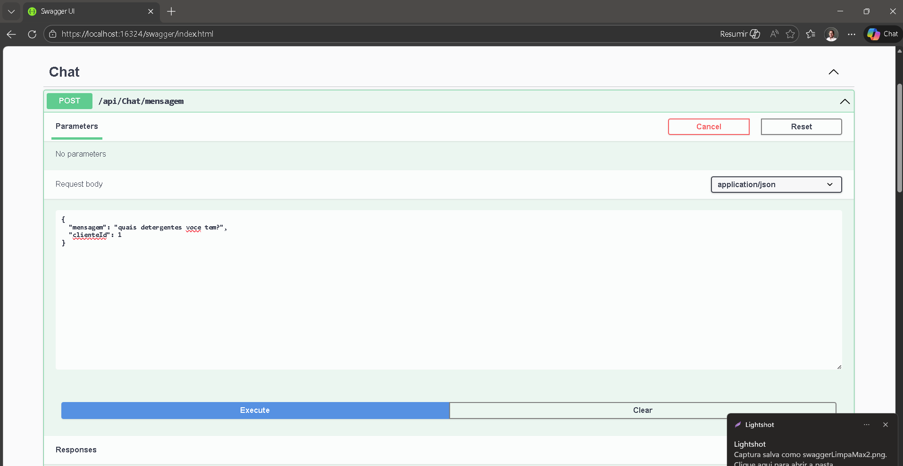
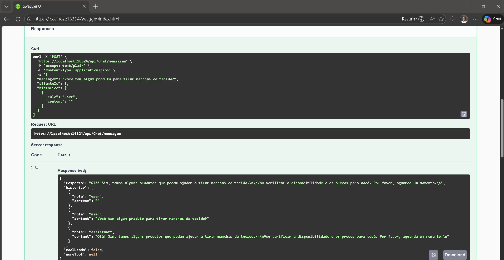

# LimpMaxAgent — Agente de IA com acesso a dados via Function Calling


AI agent capable of interacting with structured data (SQL Server) using natural language through controlled function calling.
This project demonstrates how LLMs can safely execute real operations without direct access to the database.

## 🚀 O que este projeto demonstra

- Uso de IA como **componente funcional do sistema** (não apenas como assistente)
- Integração entre LLM e backend estruturado (.NET + SQL Server)
- Arquitetura em camadas (API, Application, Domain, Infrastructure)
- Implementação de **tool calling controlado**, onde o modelo solicita ações e o sistema executa com segurança

## 💡 Problema que resolve

Permitir que usuários interajam com sistemas (estoque, pedidos, etc.) usando linguagem natural, sem acesso direto ao banco ou lógica de negócio.

## ⚙️ Como funciona

1. Usuário envia mensagem (ex: “Tem desinfetante 5L?”)
2. O agente (LLM) analisa a intenção
3. Caso necessário, solicita uma função (ex: consultar estoque)
4. O backend executa a consulta no SQL Server (via Dapper)
5. O resultado é retornado ao modelo
6. O modelo responde ao usuário em linguagem natural

👉 O modelo **não acessa diretamente o banco**, apenas solicita ações ao sistema.
👉 The LLM does not access the database directly. All operations are executed through controlled backend functions.

## 📸 Example (Swagger)




## 🧠 Exemplo

**Entrada:**
```json
{
  "mensagem": "quais detergentes voce tem?",
  "clienteId": 1
}
```

**Saída:**
```json
{
  "resposta": "Temos duas opções de detergente neutro:\n\n*   **Detergente Neutro 500ml**: R$2,50 a unidade, com 1200 unidades disponíveis.\n*   **Detergente Neutro 5L**: R$18,90 a unidade, com 350 unidades disponíveis.\n\nQual você gostaria de pedir ou tem interesse em saber mais?"
}
```

## 🧱 Arquitetura

- API → Entrada HTTP e controle de fluxo  
- Application → Orquestração do agente e regras  
- Domain → Entidades e contratos  
- Infrastructure → Acesso a dados (SQL Server + Dapper)  
- CrossCutting → Injeção de dependência  

## 🔧 Tecnologias

- .NET / C#  
- SQL Server  
- Dapper  
- Anthropic (Claude)  
- Function Calling / Tool Use  

## 🛠️ Funcionalidades do agente

- Consultar estoque  
- Registrar pedidos  
- Consultar pedidos  
- Cancelar pedidos  

## ▶️ Como executar

1. Criar banco via script SQL  
2. Configurar API Key  
3. Instalar dependências  
4. Executar via Visual Studio (Swagger disponível)

## 📌 Próximos passos

- Autenticação JWT  
- Persistência de histórico  
- Cache de consultas  
- Suporte a múltiplas tools  
- Testes automatizados

## Guia de Instalação e Uso

## Estrutura da Solution

```
LimpMaxAgent/
│
├── LimpMaxAgent.API/               ← Entrada HTTP (Controllers, Middlewares, Program.cs)
│   ├── Controllers/
│   │   └── ChatController.cs       ← Endpoint POST /api/chat/mensagem
│   ├── Middlewares/
│   │   └── ExceptionMiddleware.cs  ← Captura erros globais
│   └── Program.cs                  ← Startup, DI, pipeline
│
├── LimpMaxAgent.Application/       ← Regras de negócio, orquestração
│   ├── DTOs/
│   │   └── DTOs.cs                 ← Objetos de entrada/saída
│   ├── Interfaces/
│   │   └── IServices.cs            ← Contratos dos serviços
│   └── Services/
│       ├── ChatService.cs          ← Loop principal: LLM + tool calling
│       └── AgentToolsService.cs    ← Funções que o LLM pode chamar
│
├── LimpMaxAgent.Domain/            ← Entidades e contratos do domínio
│   ├── Entities/
│   │   └── Entities.cs             ← Produto, Estoque, Cliente, Pedido, ItemPedido
│   └── Interfaces/
│       └── IRepositories.cs        ← Contratos dos repositórios
│
├── LimpMaxAgent.Infrastructure/    ← Acesso a dados (SQL Server + Dapper)
│   ├── Repositories/
│   │   └── Repositories.cs        ← ProdutoRepository, PedidoRepository, ClienteRepository
│   └── Data/
│       └── CreateDatabase.sql     ← Script para criar o banco
│
└── LimpMaxAgent.CrossCutting/      ← Configuração de DI
    └── DependencyInjection.cs      ← Registra tudo no container
```

---

## Como o Function Calling funciona (o ponto central)

```
1. Usuário envia mensagem via POST /api/chat/mensagem
         ↓
2. ChatService monta o histórico + define as tools disponíveis
         ↓
3. LLM recebe mensagem + lista de ferramentas
         ↓
4. LLM decide: preciso de dados → retorna tool_use (ex: consultar_estoque)
         ↓
5. Nosso código executa AgentToolsService.ConsultarEstoqueAsync()
         ↓
6. AgentToolsService consulta o SQL Server via Dapper
         ↓
7. Resultado (JSON) é devolvido ao LLM
         ↓
8. LLM formula a resposta em linguagem natural
         ↓
9. Resposta chega ao usuário
```

O LLM **nunca acessa o banco diretamente**. Ele apenas "pede" que o código faça isso.

---

## Ferramentas disponíveis para o agente

| Tool | Quando o LLM chama |
|---|---|
| `consultar_estoque` | Cliente pergunta sobre produto/preço |
| `registrar_pedido` | Cliente confirma que quer comprar |
| `consultar_pedidos` | Cliente pergunta sobre pedidos anteriores |
| `cancelar_pedido` | Cliente solicita cancelamento |

---

## Como rodar

### 1. Criar o banco
Abra o SQL Server Management Studio e execute:
```
LimpMaxAgent.Infrastructure/Data/CreateDatabase.sql
```

### 2. Configurar a API key
Em `LimpMaxAgent.API/appsettings.json`:
```json
{
  "Anthropic": {
    "ApiKey": "sk-ant-..."
  }
}
```

### 3. Instalar pacotes NuGet
No Package Manager Console:
```
Install-Package Anthropic.SDK
Install-Package Dapper
Install-Package Microsoft.Data.SqlClient
```

### 4. Rodar
`F5` no Visual Studio — o Swagger abre em `https://localhost:{porta}/swagger`

---

## Testando pelo Swagger

**POST** `/api/chat/mensagem`

```json
{
  "mensagem": "Tem desinfetante 5L?",
  "clienteId": 1,
  "historico": []
}
```

Resposta esperada:
```json
{
  "resposta": "Sim! Temos o Desinfetante Pinho 5L por R$22,00, com 280 unidades disponíveis. Deseja fazer um pedido?",
  "historico": [...],
  "toolUsada": true,
  "nomeTool": "consultar_estoque"
}
```

---

## Próximos passos para evoluir

- [ ] Autenticação JWT no Controller
- [ ] Cache de produtos (evitar queries repetidas ao banco)
- [ ] Histórico persistido no banco (não depender do frontend guardar)
- [ ] Múltiplas tools numa mesma resposta (LLM pode chamar várias)
- [ ] Testes unitários dos Services (mockar repositórios com Moq)
- [ ] Frontend simples em HTML/JS para testar o chat
